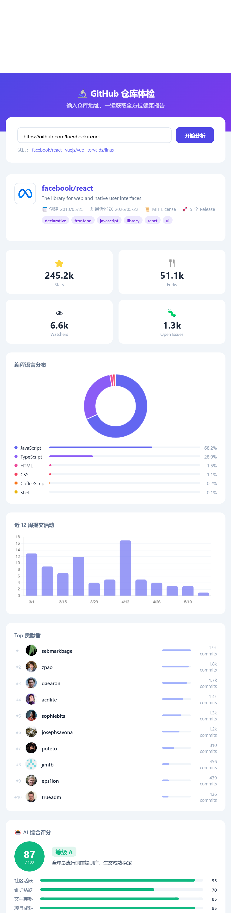

# GitHub 仓库体检 🔬

一键输入 GitHub 仓库地址，自动分析并可视化展示仓库健康指标，结合 AI 给出综合评分。

## 效果预览




## 功能

| 功能 | 说明 |
|------|------|
| ⭐ 核心指标 | Stars、Forks、Watchers、Open Issues |
| 🥧 语言分布 | 环形图 + 百分比进度条 |
| 📊 提交趋势 | 近 12 周提交活动柱状图 |
| 👥 贡献者榜 | Top 10 贡献者头像、提交数 |
| 🤖 AI 评分 | 综合分数 + 等级 + 维度雷达 + 亮点/风险 |

## 快速启动

**环境要求：** Node.js 18+

```bash
# 1. 克隆仓库
git clone https://github.com/Ningli-123/github-health-check.git
cd github-health-check

# 2. 安装依赖
npm install

# 3. 配置 API Key（复制示例文件）
cp .env.example .env
# 编辑 .env，填入你的 Key

# 4. 启动
node server.js
```

浏览器打开 → http://localhost:8001

## 环境变量配置

在项目根目录创建 `.env` 文件：

```env
# GitHub Token（提升 API 配额 60→5000次/小时）
GITHUB_TOKEN=ghp_your_token_here

# AI 评分（支持任意 OpenAI 兼容接口）
AI_API_KEY=sk-your_key_here
AI_BASE_URL=https://api.deepseek.com   # 或 https://api.openai.com
AI_MODEL=deepseek-chat                  # 或 gpt-4o-mini
```

> `.env` 已加入 `.gitignore`，不会上传到 GitHub。

## 技术栈

| 层次 | 技术 |
|------|------|
| 后端 | Node.js + Express（原生 fetch 并发调用 GitHub API） |
| AI   | OpenAI 兼容接口（默认 DeepSeek，可替换） |
| 前端 | 原生 HTML/CSS/JS + Chart.js（CDN，无需构建） |
