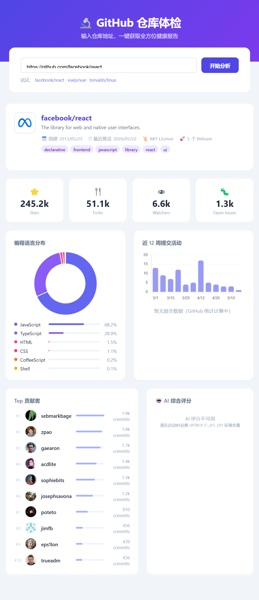
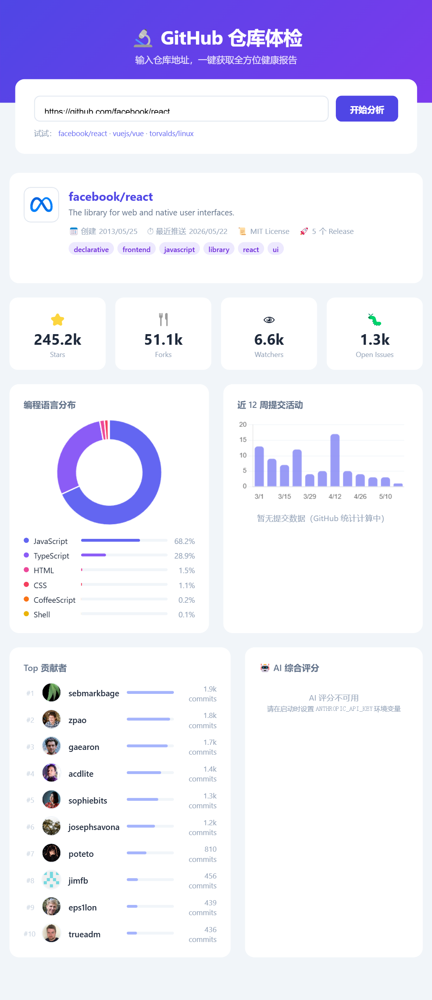

# GitHub 仓库体检 🔬

一键输入 GitHub 仓库地址，自动分析并可视化展示仓库健康指标，结合 Claude AI 给出综合评分。

## 效果预览





## 功能

| 功能 | 说明 |
|------|------|
| ⭐ 核心指标 | Stars、Forks、Watchers、Open Issues |
| 🥧 语言分布 | 环形图 + 百分比进度条 |
| 📊 提交趋势 | 近 12 周提交活动柱状图 |
| 👥 贡献者榜 | Top 10 贡献者头像、提交数 |
| 🤖 AI 评分 | 综合评分 + 等级 + 亮点/风险（需配置 API Key）|

## 快速启动

**环境要求：** Node.js 18+

```bash
# 1. 克隆仓库
git clone https://github.com/Ningli-123/github-health-check.git
cd github-health-check

# 2. 安装依赖
npm install

# 3. 启动
node server.js
```

浏览器打开 → http://localhost:8001

## 开启 AI 评分（可选）

```bash
# Windows PowerShell
$env:ANTHROPIC_API_KEY="sk-ant-..."
$env:GITHUB_TOKEN="ghp_..."     # 可选，提升 GitHub API 配额 60→5000次/小时
node server.js
```

```bash
# macOS / Linux
export ANTHROPIC_API_KEY="sk-ant-..."
export GITHUB_TOKEN="ghp_..."
node server.js
```

## 技术栈

| 层次 | 技术 |
|------|------|
| 后端 | Node.js + Express（原生 fetch 并发调用 GitHub API） |
| AI   | Anthropic Claude claude-sonnet-4-6 |
| 前端 | 原生 HTML/CSS/JS + Chart.js（CDN，无需构建） |

## 注意事项

- 未配置 `GITHUB_TOKEN` 时，GitHub API 限速为 60 次/小时
- 部分大型仓库的提交统计由 GitHub 异步计算，首次请求可能为空，刷新重试即可
- 私有仓库无法访问
